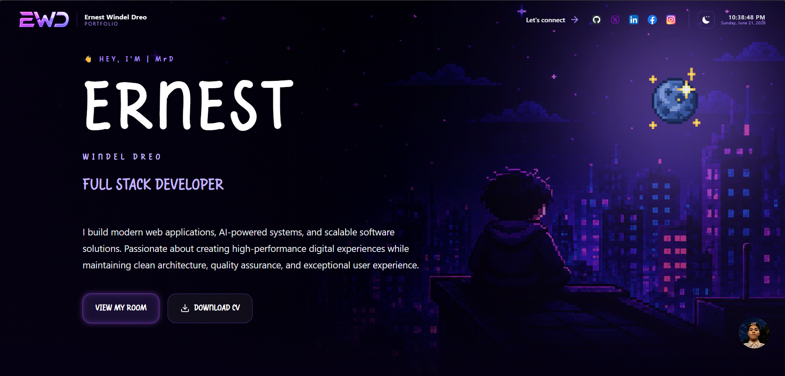
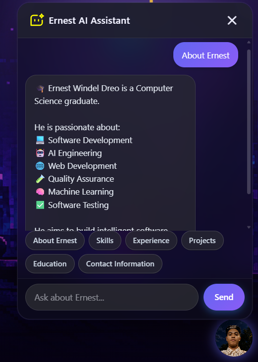
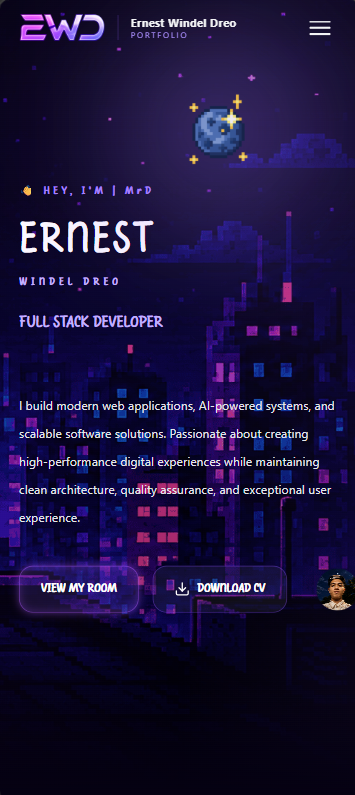

# 🚀 Ernest Windel Dreo – AI-Powered Portfolio

A modern, interactive portfolio website built to showcase my skills, experience, projects, achievements, and career journey as a **Software Developer**, **AI Engineer**, and **Computer Science Graduate**.

The portfolio includes a custom-built **AI Agent** capable of answering questions about me, my projects, technical skills, education, certifications, and professional experience.

---

## 🌟 Live Demo

### Portfolio Website

**Portfolio:** https://your-portfolio-link.vercel.app

### AI Agent Demo

Integrated directly into the portfolio website.

---

# 📖 About the Project

This portfolio was designed to go beyond a traditional personal website.

Instead of simply displaying static information, it includes an intelligent AI-powered assistant that can answer questions about my:

* Professional background
* Technical skills
* Work experience
* Education
* Certifications
* Projects
* Contact information

The goal is to create a more engaging and interactive experience for recruiters, employers, clients, and fellow developers.

---

# 📸 Screenshots

> Replace the images below with actual screenshots from your project.

## 🖥️ Desktop Portfolio



---

## 🤖 AI Agent Chat Window



---

## 📱 Mobile View



---

# ✨ Features

## 🤖 Interactive AI Agent

A floating AI assistant that can answer questions about Ernest in real-time.

### Capabilities

* Resume-based knowledge
* Project recommendations
* Skills overview
* Career background
* Education details
* Certification details
* Contact information

---

## 🎨 Modern UI Design

* Glassmorphism interface
* Smooth animations
* Framer Motion transitions
* Theme-aware components
* Modern responsive layout

---

## 🌙 Dark & Light Mode

Supports:

* Dark Theme
* Light Theme
* Dynamic AI avatar switching
* Theme-aware assets

---

## 📱 Fully Responsive

Optimized for:

* Mobile devices
* Tablets
* Laptops
* Desktop screens

---

## 🎵 Interactive Music System

Features:

* Clickable Moon / Sun controls
* Background chill music
* Play / Pause functionality
* Theme synchronization

---

## 🕹️ Pixel-Inspired Experience

Includes:

* Pixel fonts
* Retro-inspired visuals
* Interactive animations
* Gaming-style portfolio elements

---

## ⚡ Performance Focused

Built using:

* React
* Vite
* Tailwind CSS

for fast loading speeds and smooth user experience.

---

# 🧠 AI Agent Overview

The AI Agent acts as a personal digital representative.

It understands information from a structured knowledge base and responds to user questions using AI.

---

## Knowledge Sources

The AI can access:

* Personal profile
* About section
* Technical skills
* Work experience
* Education
* Certifications
* Projects
* Contact information

---

## AI Features

### Smart Context Builder

Automatically combines relevant information before sending prompts to the AI model.

### Resume-Aware Responses

Answers are based only on Ernest's information.

### Markdown Sanitization

Removes unnecessary markdown formatting and improves readability.

### Emoji Enhancement

Automatically adds context-appropriate emojis.

### Theme-Aware Avatar

Different AI assistant images for:

* Dark mode
* Light mode
* Hover states

### Draggable Widget

Users can freely move the AI assistant button across the screen.

### Mobile Optimized

* Smaller floating button
* Compact chat interface
* Better touch interactions

---

# 💬 Example Questions

Users can ask:

### About

* Tell me about Ernest
* Who is Ernest Windel Dreo?
* What is Ernest's background?

### Skills

* What technologies does Ernest use?
* What are his programming languages?
* What frameworks does he know?

### Projects

* Show me Ernest's projects
* What is TruthFinder?
* What is Futurvia?
* Tell me about Jarvis AI

### Experience

* What experience does Ernest have?
* What did he do during his internship?

### Education

* What degree does Ernest have?
* What certifications does he hold?

### Contact

* How can I contact Ernest?
* Where can I find his GitHub?
* Does he have LinkedIn?

---

# 🛠️ Tech Stack

## Frontend

* React
* Vite
* Tailwind CSS
* Framer Motion
* Lucide React

---

## AI Integration

### OpenRouter

Supports models such as:

* GPT-4
* GPT-4o
* Claude
* Gemini
* DeepSeek

---

### Gemini API (Optional)

Alternative AI provider integration.

---

## State Management

React Hooks

* useState
* useEffect
* useMemo
* useCallback
* useSyncExternalStore

---

## Custom Hooks

* useAI
* useTheme
* useMediaQuery

---

# 📁 Project Structure

```text
src/
│
├── ai/
│   ├── knowledge/
│   │   ├── about.js
│   │   ├── skills.js
│   │   ├── experience.js
│   │   ├── projects.js
│   │   ├── education.js
│   │   ├── contact.js
│   │   └── index.js
│   │
│   ├── prompts/
│   │   ├── systemPrompt.js
│   │   └── welcomeMessage.js
│   │
│   ├── services/
│   │   ├── openrouter.js
│   │   ├── gemini.js
│   │   └── aiService.js
│   │
│   └── utils/
│       ├── buildContext.js
│       ├── sanitizeMessage.js
│       └── suggestions.js
│
├── components/
│   └── AIAgent/
│       ├── AIAgent.jsx
│       ├── AIWidgetButton.jsx
│       ├── AIChatWindow.jsx
│       ├── AIMessage.jsx
│       ├── AIInput.jsx
│       ├── AIQuickActions.jsx
│       └── AIAvatar.jsx
│
├── hooks/
│   ├── useAI.js
│   ├── useTheme.js
│   └── useMediaQuery.js
│
└── assets/
    └── ai/
        ├── ai-light-idle.png
        ├── ai-light-hover.png
        ├── ai-dark-idle.png
        ├── ai-dark-hover.png
        └── ai-assistant.svg
```

---

# ⚙️ Installation

## 1. Clone the Repository

```bash
git clone https://github.com/ErnestChainDev/portfolio.git
cd portfolio
```

---

## 2. Install Dependencies

```bash
npm install
```

---

## 3. Configure Environment Variables

Create a `.env` file in the root directory.

```env
VITE_OPENROUTER_API_KEY=your_openrouter_api_key_here
```

Optional:

```env
VITE_GEMINI_API_KEY=your_gemini_api_key_here
```

---

## 4. Start Development Server

```bash
npm run dev
```

---

## 5. Build for Production

```bash
npm run build
```

---

## 6. Preview Production Build

```bash
npm run preview
```

---

# 🎨 Customization

## Update Personal Information

Edit:

```text
src/ai/knowledge/
```

Files:

* about.js
* skills.js
* experience.js
* projects.js
* education.js
* contact.js

---

## Change AI Model

Edit:

```text
src/ai/services/openrouter.js
```

Example:

```javascript
model: "openai/gpt-4o-mini"
```

---

## Replace AI Images

Update:

```text
src/assets/ai/
```

Replace:

* ai-light-idle.png
* ai-light-hover.png
* ai-dark-idle.png
* ai-dark-hover.png

---

## Customize Chat Window

Modify:

```text
src/components/AIAgent/AIChatWindow.jsx
```

---

# 🚀 Featured Projects

## 🤖 Jarvis AI

An all-in-one AI assistant platform designed to help with:

* Coding
* Research
* Career development
* Productivity
* Startup validation
* Knowledge management

---

## 🌐 Futurvia

AI-powered platform combining:

* Modern frontend experience
* FastAPI backend
* PostgreSQL database
* OpenRouter LLM integration

---

## 📰 TruthFinder

Fact-checking and misinformation detection platform built to identify potentially misleading content.

---

# 🎓 Education

**Bachelor of Science in Computer Science**

Recent graduate with academic excellence awards and active participation in technology organizations.

---

# 📜 Certifications

### Cisco Networking Academy

* Computer Hardware Basic Course
* Operating System Basic Course
* Endpoint Security Course

### DICT Internship Program

* Apprenticeship Completion Certificate

---

# 📌 Notes

* Fully frontend-based AI assistant
* No backend database required
* Easily customizable knowledge base
* Fast deployment using Vercel
* Supports multiple AI providers

---

# 📬 Contact Information

### 📧 Email

[ernestchaindev@gmail.com](mailto:ernestchaindev@gmail.com)

### 💻 GitHub

[https://github.com](https://github.com/ErnestChainDev)

### 🔗 LinkedIn

[https://linkedin.com](https://www.linkedin.com/in/ernest-windel-dreo-3934b3368)

---

# 🤝 Let's Connect

I'm always interested in:

* Software Engineering opportunities
* AI Engineering roles
* Web Development projects
* Freelance work
* Open-source collaboration

Feel free to reach out and connect.

---

# ⭐ Support

If you like this project:

* Star the repository
* Fork the project
* Share it with others

---

## Made with ❤️ by Ernest Windel Dreo

**Software Developer • AI Engineer • Computer Science Graduate**
